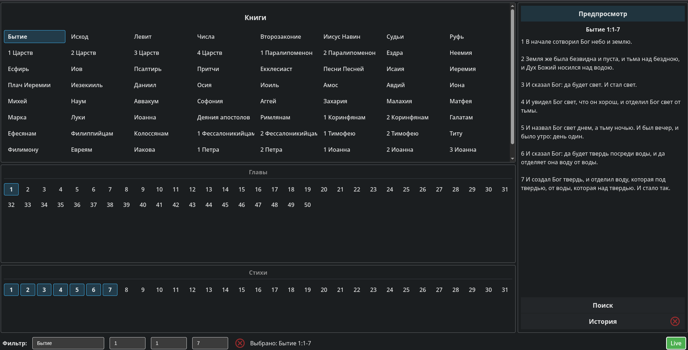

# Библейский Селектор Стихов (Bible Verse Selector) для OpenLP

https://openlp.org/

Приложение для выбора и отправки библейских стихов на внешний сервис отображения OpenLP.



<a href="https://www.youtube.com/watch?v=N11VnjwREaI" target="_blank">Демонстрация</a>

## Описание

Библейский Селектор Стихов - это React-приложение, разработанное для удобного выбора и отправки библейских стихов. Приложение позволяет пользователям выбирать книги Библии, главы и отдельные стихи или диапазоны стихов, а затем отправлять выбранные стихи на внешний API для отображения.

### Основные возможности

- Выбор книг, глав и стихов Библии на русском и других языках
- Выбор как отдельных стихов, так и диапазонов стихов
- История выбранных стихов для быстрого доступа
- Отправка выбранных стихов на внешний API по кнопке "Live"
- Отображение статуса отправки в информационной панели

## Технологии

- React 18
- Vite
- CSS для стилизации компонентов
- Fetch API для взаимодействия с внешним API

## Структура проекта

Проект имеет модульную структуру с разделением компонентов по функциональности:

- `components/book` - компоненты для выбора книг Библии
- `components/chapter` - компоненты для выбора глав
- `components/verse` - компоненты для выбора стихов
- `components/history` - компоненты для работы с историей выбора
- `components/live` - компоненты для отправки стихов на внешний API
- `services` - сервисы для работы с API
- `utils` - вспомогательные функции и утилиты

## Подготовка данных

Перед использованием приложения необходимо подготовить данные о структуре Библии:

1. Задайте в скрипте путь к SQLite базе данных Библии в .env файле
2. Используйте скрипт `src/scripts/ScanSqLiteBible.js` для сканирования SQLite базы данных Библии из OpenLP
3. Скрипт генерирует файл `bible_summary.json`, который содержит структуру книг, глав и количество стихов
4. По пути `src/data/bible_summary.json` обновится JSON-файл 

Пример запуска скрипта:
```bash
node ScanSqLiteBible.js
```

## Установка и запуск

```bash
# Установка зависимостей
npm install

# Запуск в режиме разработки
npm run dev

# Сборка для продакшена
npm run build

# Предпросмотр собранного приложения
npm run preview
```

Готовый билд можно разместить в кастомном стейже в самом OpenLP (~/.local/share/openlp/stages/VerseSelector).
Потом открывать его следует по адресу http://localhost:4316/stage/VerseSelector/

## API интеграция

### Elasticsearch для поиска по Библии

Для работы функции поиска по тексту Библии необходимо настроить Elasticsearch:

1. **Запуск Elasticsearch через Docker**

   В корне проекта есть файл `docker-compose.yml` с настройками для Elasticsearch:

   ```bash
   # Запуск Elasticsearch контейнера
   docker-compose up -d elasticsearch
   ```

   Это запустит Elasticsearch на порту 9200 с настроенными CORS-заголовками для доступа из браузера.

2. **Индексация библейских текстов**

   После запуска Elasticsearch необходимо заполнить его данными из SQLite базы:

   ```bash
   # Запуск скрипта индексации
   npm run index-bible
   ```

   Скрипт `src/scripts/IndexBibleToElasticsearch.js` выполнит следующие действия:
   - Создаст индекс `bible_verses` с оптимизированными настройками для русского языка
   - Прочитает все стихи из SQLite базы данных
   - Загрузит их в Elasticsearch с поддержкой полнотекстового поиска
   - Настроит подсветку найденных фрагментов текста

3. **Проверка работы Elasticsearch**

   После индексации можно проверить доступность Elasticsearch:
   - Откройте http://localhost:9200/_cat/indices в браузере
   - Вы должны увидеть индекс `bible_verses` с количеством документов

### OpenLP API

Приложение взаимодействует с локальным API по адресу `http://localhost:4316/api/v2/plugins/bibles/live`. Выбранные стихи отправляются в формате JSON с полем `id`, содержащим ссылку на стих в формате "Книга Глава:Стих" или "Книга Глава:Стих-СтихКонец" для диапазонов.

## Использование

1. Выберите книгу Библии из левой панели
2. Выберите главу из списка глав
3. Выберите стих или диапазон стихов (для выбора диапазона кликните на начальный стих, затем на конечный)
4. Нажмите кнопку "Live" для отправки выбранного стиха на внешний API
5. Статус отправки будет отображаться в информационной панели

## Лицензия

MIT
